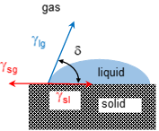

# Automazing contact angle calculations in time-series images

## Introduction

Wetting properties of surfaces and their measurement are essential in many industries. For example, the contact angle can be used to quantify the wetting of a substrate by a liquid, see the calculation of contact angle in Figure below.

In this project, I want to detect the droplet and the surface where the droplet stands, and to calculate the contact angle between them, see an image below.

## Dataset
You can find a small dataset (10 images) in the folder `data` and the corresponding results in the folder `results`.

## Installation
You need `MATLAB-R2019a` to run the code.

## Challenges & Approaches

I divide the project into four tasks: Localization of the droplet-surface contact, detection of the surface line, detection of the droplet boundary and fitting an ellipse to the droplet boundary. And, I calculate the contact angle by using the equations of the detected surface line and the fitted elipse.

Before I explain the tasks individually, I want to mention a few things about the dataset and the algorithm. The images are not focused on the contact because the experimental setup did not allow to do it so. Also, the lighting in the setup varies from one to another, check the folder `figures/experimental_setups`. These things are some challenges with the task. Regarding the algorithm, since I have a time-series dataset, I take advantage of the whole dataset to locate the contact, and to detect the surface line and the droplet boundary. Here is a brief description for each task in the algorithm:

### Localization of the droplet-surface contact
I make up some heuristic rules by using the number of white pixels in rows and columns to locate the contact.
### Detection of the surface line
I apply the Hough transform to the edge image of the localized contact image for detecting the surface line.
### Detection of the droplet boundary
I use the marker-based watershed segmentation algorithm by marking the background and the droplet.
### Fitting an ellipse to the droplet boundary
After extracting the boundaries of the droplet in the previous step, I fit an ellipse to these boundaries. For fitting the ellipse, I minimize [the ellipse function](https://www.mathworks.com/matlabcentral/fileexchange/27708-distance-from-points-to-an-ellipse) over the boundary points with the constraint of the surface line. From this calculation, I obtain an average ellipse to be used for the initial ellipse of the second fitting procedure. I apply the same minimization problem by using the initial ellipse, so I push the algorithm to have similar fitted ellipse for each image in the dataset. 

Here is the result from my algorithm.

